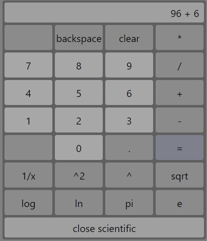
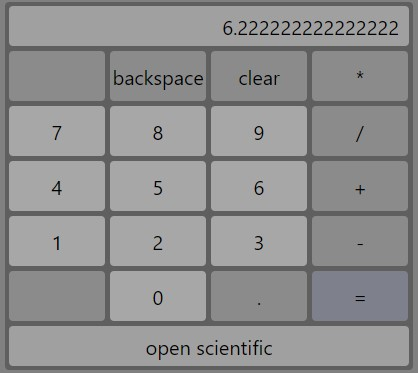

## Автор
- Miasnikov Dmitrii
- email: miasnikovdmitrii@gmail.com

## Описание
Калькулятор

## Используемые технологии
- Проект написан на React, Mobx с применением Hooks, SCSS, ES6

## Функциональные возможности
- классический калькулятор по аналогии со встроенным в виндовс
- кроме классических операций + - / *, так же реализован квадратный корень, возведение в квадрат и возведение в степень y, натуральный логарифт и логарифм по основанию 10, и константы pi и e.
- кнопки clear отчищает поле, кнопка backspace стирает крайний символ.

## Запуск
```npm run start```

## Скриншоты
[](скриншот)
[](скриншот)